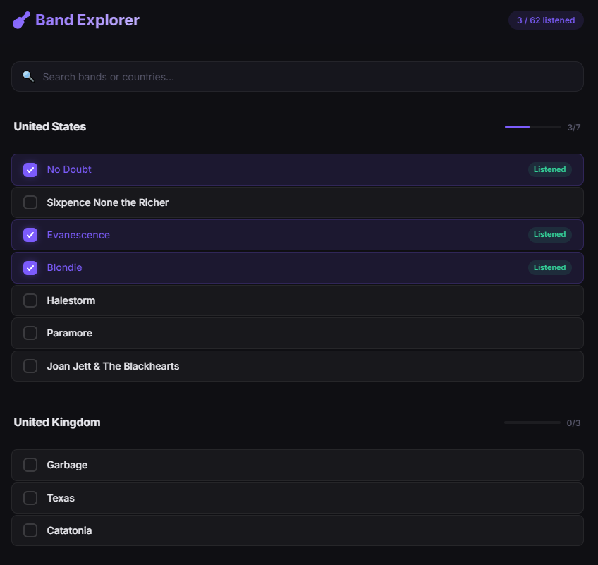

# bandsearch

Simple Flask app for browsing bands from `discovered_bands.md`, marking listened bands, and saving that state locally.



## Features

- Loads bands grouped by country from markdown headings and table rows.
- Shows bands in a single-page UI.
- Saves listened state to `listened.json`.
- Supports enriching table rows with similar artists (so they appear in the app).

## Requirements

- Python 3.9+
- `flask`

## Setup

```powershell
# from C:\git\bandsearch
python -m venv .venv
.\.venv\Scripts\Activate.ps1
pip install flask
```

If `python` points to an inaccessible WindowsApps shim, use a full interpreter path instead.

## Run the app

```powershell
python app.py
```

Then open `http://127.0.0.1:5000`.

## Data source format

`app.py` reads from `discovered_bands.md` using:

- Country section headers: `## Country Name`
- Band rows: markdown table rows where first column is bold, for example:

```md
| **No Doubt** | Gwen Stefani | 1986-Present | *Don't Speak* |
```

Only those bold first-column table rows are used as band names.

## Scripts

- `find_bands.py`
  - Generates or refreshes discovered band data (MusicBrainz-driven workflow).
- `find_similar_bands.py`
  - Collects similar-artist data.
- `add_similar_lastfm.py`
  - Adds `Similar Bands` sections using Last.fm lookups.
- `move_similar_to_table.py`
  - Moves artists listed in `### Similar Bands (via Last.fm)` into the country table rows so `app.py` can display them.
  - Added rows use:
    - `Lead Vocalist`: `Similar Artist (Last.fm)`
    - `Active Period`: `N/A`
    - `Signature Hits`: `N/A`

## Notes

- Listened state is stored in `listened.json` in this repo folder.
- Re-running `move_similar_to_table.py` is idempotent for already-moved sections.
